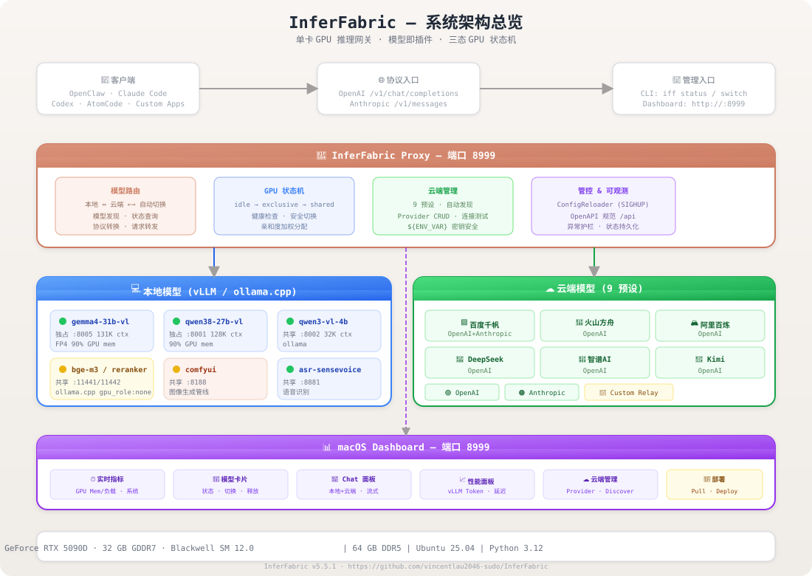
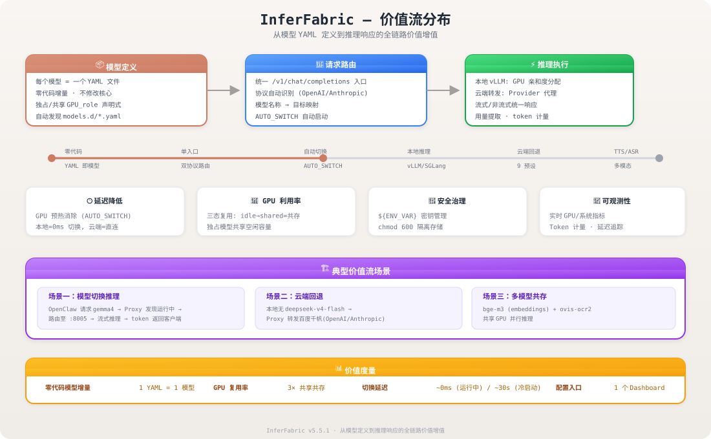
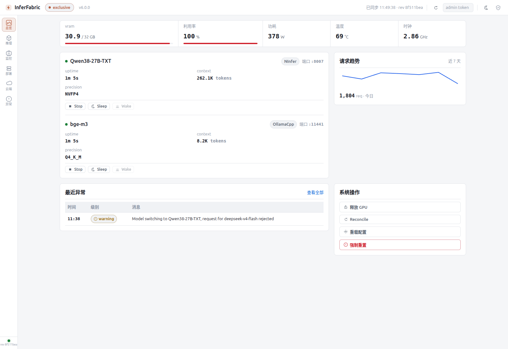
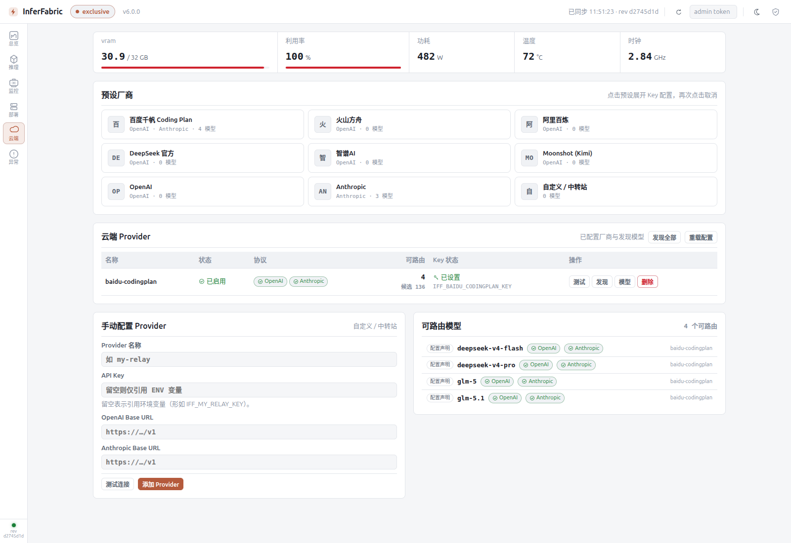
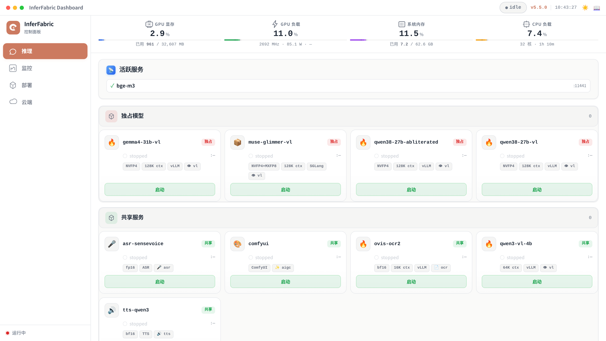
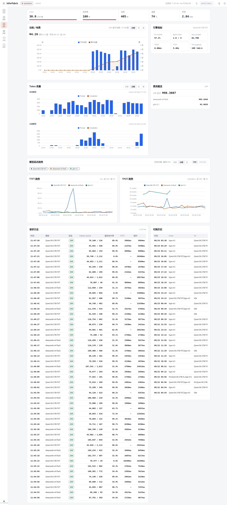
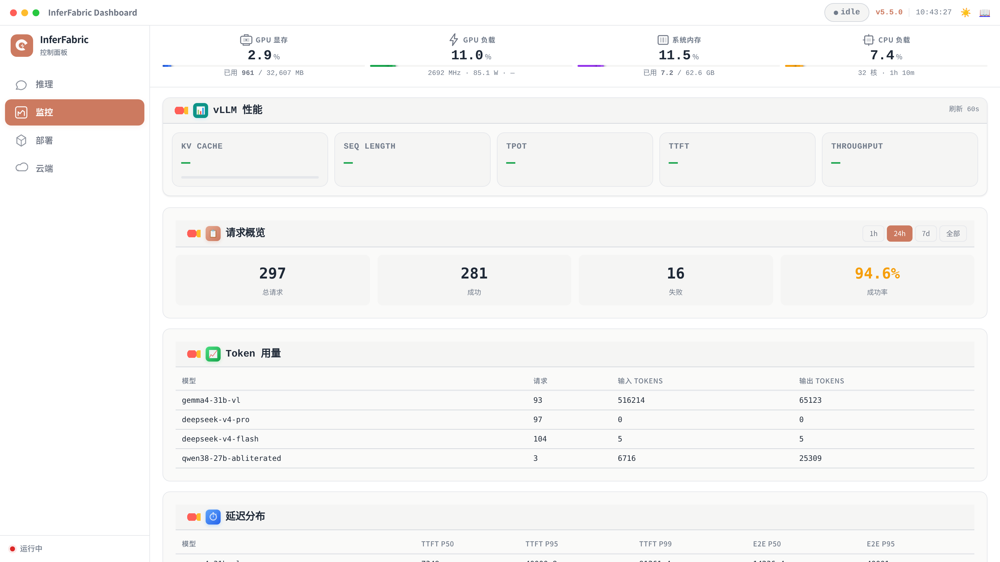

# InferFabric — LLM Inference Gateway

> **Model as Plugin. One YAML, one model. Local + Cloud, unified.**
>
> 单卡 GPU 推理网关 · 模型即插件 · 三态 GPU 状态机 · macOS Dashboard · 9 云端预设

---

## What It Solves

**The Problem**: Running multiple LLM models on a single GPU is painful. Model switching is manual. Cloud API keys are scattered in config files. Each client needs its own backend configuration.

**InferFabric solves this**:
- **Model switching without OOM** — Three-state GPU (idle/exclusive/shared) with safe transitions and health checks
- **One API, any model** — Every model—local vLLM, local ollama.cpp, or cloud OpenAI/Anthropic—is accessed through the same `/v1/chat/completions` endpoint
- **API keys never in plaintext** — `${ENV_VAR}` auto-conversion, secrets stored in `chmod 600` file
- **Dashboard, not YAML editing** — macOS sidebar dashboard for model switching, monitoring, chat testing, and cloud provider management
- **Auto-switch on demand** — Request a model and IFF boots it if needed; no manual intervention

> macOS Dashboard · Three-state GPU · OpenAI/Anthropic dual-protocol routing · 9 cloud presets · OpenAPI 3.1 spec · SIGHUP hot-reload

---

## What is InferFabric?

InferFabric is a single-GPU LLM inference gateway. It treats every model—local or cloud—as a pluggable unit, managing their lifecycle, routing, and discovery behind a unified OpenAI-compatible API.

### Architecture Overview



> **Detailed flow diagrams**: [docs/diagrams/architecture-flow.md](docs/diagrams/architecture-flow.md) — covers overall architecture, local model routing, cloud routing, anomaly event flow, response cache flow, and metrics pipeline.

---

## Architecture

### Three-State GPU Model

```
idle ─→ exclusive   (one heavy model, full GPU)
  │
  └──→ shared       (many small models, coexist)
         │
         └──→ idle   (return to idle anytime)
```

Local models operate in one of three GPU modes. The gateway enforces safe transitions—you can't accidentally start two exclusive models.

The state machine is computed from actual service processes rather than a persisted flag, so **state never drifts**. HealthMonitor decoupled from state reconciliation eliminates race conditions.

### Value Stream



The value stream spans from YAML model definition to inference response, with five core value-add layers:

| Stage | Value | Mechanism |
|-------|-------|-----------|
| **Model Definition** | Zero-code model addition | YAML in `models.d/` → auto-discovered |
| **Request Routing** | Unified protocol gateway | OpenAI + Anthropic dual-protocol at `:8999` |
| **GPU State Management** | Safe concurrent model execution | idle → exclusive/shared → idle state machine |
| **Local Inference** | Zero-latency local execution | vLLM/SGLang/Ollama with GPU affinity allocation |
| **Cloud Proxy** | Zero-protocol-translation transparent proxy | OpenAI + Anthropic dual-protocol at `:8999` |
| **Multi-modal** | Extended media pipeline | TTS, ASR, embedding, reranker services |

### Model as Plugin

Add a model = drop a YAML file. No code. No profile keys.

```yaml
# models.d/gemma4-31b-vl.yaml
name: gemma4-31b-vl
gpu_role: exclusive
model_type: vl
type: vllm
vllm:
  port: 8005
  conda_env: gemma-4-31b-vllm
  max_model_len: 131072
  gpu_memory_utilization: 0.90
```

### Dual-Protocol Routing

All requests arrive as standard OpenAI `/v1/chat/completions` or Anthropic `/v1/messages`. The gateway:

1. **Auth** — API key validation via `AuthManager`
2. **Cache** — `ResponseCache` lookup (R5): exact-match on `(model + body hash)`, `temperature=0` only
3. **SWITCHING Guard** — If a local model is being switched, cloud models pass through; other local models get `503 + Retry-After: 30`
4. **Local routing** — `find_model_by_served_name()` → active? → forward to vLLM/SGLang port; inactive? → auto-switch on demand (R0 cooldown: failed switch blocks 10s, `Retry-After: 10`)
5. **Multi-replica load balancing** (R7) — `ReplicaSelector` with `least_busy`/`round_robin` when `replicas` configured
6. **Cloud routing** — `resolve_route()` → `CloudDiscovery` → zero-protocol-translation proxy to baidu/deepseek/etc.
7. **Unknown model** (R8) — No match? → explicit `404` + `AnomalyEvent`; no silent fallback to random models

Every request path writes `RequestLog` (R1) and records structured `AnomalyEvent` (R9) on errors. Cloud retries (R2): 3 attempts with exponential backoff. Timeout (R3): 600s default.

### Cloud Provider Presets

9 pre-configured cloud providers with one-click setup:

| Provider | Discovery | Protocol |
|----------|-----------|----------|
| 百度千帆 Coding Plan | Spec | OpenAI + Anthropic |
| 火山方舟 | Auto | OpenAI |
| 阿里百炼 | Auto | OpenAI |
| DeepSeek | Auto | OpenAI |
| 智谱AI | Auto | OpenAI |
| Moonshot (Kimi) | Auto | OpenAI |
| OpenAI | Auto | OpenAI |
| Anthropic | Spec | Anthropic |
| Custom Relay | Manual | OpenAI + Anthropic |

API Keys are never stored in plaintext—automatically converted to `${ENV_VAR}` references and persisted in a `chmod 600` secrets file.

---

## Dashboard (v5.5.x)

A macOS-inspired sidebar dashboard for model management, monitoring, and chat testing:

### Screenshots

| | |
|:---:|:---:|
| **Overview — GPU metrics + model cards** | **Cloud providers management** |
|  |  |
| **Chat inference panel** | **Metrics & monitoring** |
|  |  |
| **GPU status & vLLM performance** | |
|  | |

**Features**:
- Sidebar navigation (推理/监控/云端/部署/Chat)
- Live 4-metric bar: GPU memory · GPU load · System memory · CPU load
- Model card grid with macOS-icon-box layout, status badges, start/stop controls
- vLLM performance panels: token throughput, latency distribution, KV cache usage
- Token usage charts with time-series visualization
- Cloud provider management: CRUD, auto-discover, connection test
- Chat inference panel with local + cloud model support, streaming responses
- Dark mode, typography hierarchy, WCAG AA contrast
- OpenAPI spec viewer (📖 link in top bar)

---

## Quick Start

```bash
# View all models
iff status

# Switch to a model (auto-start if stopped)
iff switch gemma4-31b-vl

# Return to idle
iff switch idle

# Dashboard at http://localhost:8999
```

---

## API Endpoints

### Core

| Method | Path | Description |
|--------|------|-------------|
| `GET`  | `/` | macOS Dashboard |
| `GET`  | `/status` | GPU state, active services, health |
| `GET`  | `/models` | All configured models |
| `GET`  | `/api/metrics` | Aggregated request metrics (JSON) |
| `GET`  | `/metrics` | Prometheus text format (R6) |
| `GET`  | `/api/request_log` | Request log history (R1) |
| `GET`  | `/api/anomalies` | Structured anomaly events (R9) |
| `POST` | `/v1/chat/completions` | OpenAI-compatible chat |
| `POST` | `/v1/messages` | Anthropic-compatible messages |
| `POST` | `/v1/embeddings` | Embedding requests |

### Control

| Method | Path | Description |
|--------|------|-------------|
| `POST` | `/switch` | Switch model `{"model":"gemma4-31b-vl"}` |
| `POST` | `/stop` | Stop a shared service |
| `POST` | `/reset` | Force reset to idle |
| `POST` | `/reconcile` | Fix state.db vs reality |
| `GET`  | `/reload-config` | SIGHUP hot-reload |

### Model Management

| Method | Path | Description |
|--------|------|-------------|
| `GET`  | `/deploy` | Deploy form |
| `POST` | `/deploy` | Deploy a new model |
| `GET`  | `/pull` | Pull model form |
| `POST` | `/pull` | Pull a remote model |

### Cloud Admin

| Method | Path | Description |
|--------|------|-------------|
| `GET`  | `/admin/cloud/presets` | Provider presets |
| `GET/POST/DELETE` | `/admin/cloud/providers` | Manage providers |
| `POST` | `/admin/cloud/discover` | Discover models |
| `POST` | `/admin/cloud/test` | Test connection |

### OpenAPI 3.1 Specification

The full API is documented in OpenAPI 3.1.0 format:

- **JSON endpoint**: `GET /api/openapi.json` — auto-generated from YAML with live version injection
- **Source file**: `api-spec/openapi.yaml` (1014 lines)
- **Shared schemas**: `api-spec/components/schemas.yaml` (708 lines)
- **Coverage**: 37 endpoints, all request/response schemas, error models

---

## Port Map

| Port | Service | Type | GPU Role |
|------|---------|------|----------|
| 8001 | qwen38-27b-vl | vLLM | exclusive |
| 8005 | gemma4-31b-vl | vLLM | exclusive |
| 8002 | qwen3-vl-4b | vLLM / ollama | shared |
| 8004 | ovis-ocr2 | vLLM | shared |
| 8188 | comfyui | ComfyUI | shared |
| 8880 | tts-qwen3 | TTS | shared |
| 8881 | asr-sensevoice | ASR | shared |
| 11441 | bge-m3 | ollama.cpp | none |
| 11442 | bge-reranker | ollama.cpp | none |
| 8999 | **Proxy** | HTTP | — |

---

## Recovery

```bash
iff reset                          # Force idle
iff reconcile                      # Fix state.db
~/inferfabric/scripts/iff-recovery.sh --full  # Nuclear
```

---

## Version History

| Version | Date | Highlights |
|---------|------|------------|
| v4.0 | 2026-06 | Model plugin architecture, three-state GPU |
| v4.6 | 2026-07 | Cloud discovery, provider management, Dashboard |
| v4.7 | 2026-08 | Cloud presets, API key security, TTS support |
| **v5.4.0** | **2026-08** | **macOS Dashboard: sidebar, chat, 12 SVG icons, dark mode** |
| **v5.5.0** | **2026-08** | GPU state computed property (no drift), HealthMonitor de-reconciled, SIGHUP ConfigReloader, global exception guardrail + 15 `except:pass` fixes, `/reload-config` button, dead code cleanup (forward_to_baidu → unified cloud_provider.yaml), `/local-models` disk-scan guard, UI polish: typography hierarchy + 4px spacing system + WCAG AA contrast, model card macOS icon-box layout, perfPanel stay-visible fix |
| **v5.5.1** | **2026-08** | OpenAPI 3.1.0 specification (1014 lines, 37 endpoints, shared schemas), `/api/openapi.json` endpoint with live version injection, Dashboard 📖 OpenAPI link in top bar, asr-sensevoice rename, state management refactoring + 10 dead code cleanup items |
| **v5.6.7** | **2026-09** | R0: `ensure_service` cooldown fix — failed switch arms 10s cooldown, ends infinite 503 storm |
| **v5.6.8** | **2026-09** | **Gateway Hardening Complete**: R1 request_log blind spots, R2 cloud retry (3x backoff), R3 timeout 60s→600s, R4 per-model concurrency pool, R5 response cache (cachetools LRU), R6 Prometheus /metrics, R7 async server + multi-replica + least_busy load balancing, R8 remove silent fallback (unknown model → 404), R9 AnomalyCollector + /api/anomalies, R10 anomaly dashboard tab. Full architecture flow at `docs/diagrams/architecture-flow.md` |

---

## Hardware

- **GPU**: NVIDIA GeForce RTX 5090D, 32 GB GDDR7, 512-bit, 1792 GB/s, Blackwell (SM 12.0)
- **RAM**: 64 GB DDR5
- **OS**: Ubuntu 25.04, Python 3.12+

---

[InferFabric](https://github.com/vincentlau2046-sudo/InferFabric) · MIT License